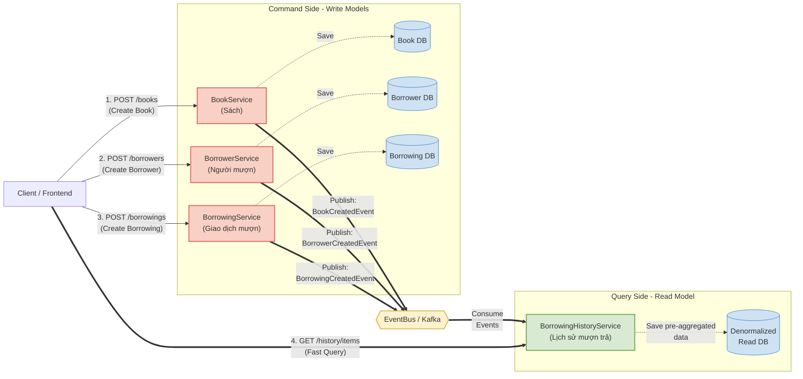

# CQRS Pattern Flow & Structure

Đây là tài liệu mô tả luồng hoạt động (flow) của pattern **CQRS** trong project `MicroservicePatterns`, tuân thủ theo các quy chuẩn kiến trúc đã đề ra trong `AGENT.md`.

## 1. Overview Diagram

Sơ đồ dưới đây thể hiện sự phân tách giữa **Command** (Write side) và **Query** (Read side), cùng cơ chế đồng bộ dữ liệu thông qua **Integration Events** (EventBus/Kafka).

---

## 2. Chi tiết luồng xử lý (Flow Details)

Theo chuẩn CQRS của dự án, mọi thao tác ghi (Write) và đọc (Read) được tách biệt hoàn toàn về mặt Database và Service.

### Bước 1: Khởi tạo dữ liệu (Write / Commands)
- Người dùng gọi API `POST` đến các Write Services (`BookService`, `BorrowerService`, `BorrowingService`).
- Service xử lý Command:
  - Lưu thực thể (Entity) vào Database cục bộ của service đó.
  - Publish một **Integration Event** (ví dụ: `BookCreatedIntegrationEvent`) vào Messaging Broker (Kafka thông qua `EventBus`).
- **Convention:** Write DB được chuẩn hóa cao nhất có thể, tập trung vào Transaction (ACID) của nghiệp vụ cụ thể.

### Bước 2: Đồng bộ dữ liệu sang Read Model
- `BorrowingHistoryService` đóng vai trò là **Read Model**.
- Service này subscribe tất cả các Integration Events từ các Write Services:
  - Nhận `BookCreated...` -> Lưu thông tin sách.
  - Nhận `BorrowerCreated...` -> Lưu thông tin người mượn.
  - Nhận `BorrowingCreated...` -> Nối dữ liệu (Denormalize) giữa Sách, Người mượn và Giao dịch để tạo thành một bảng `History` dạng phẳng (Flat Table).
- **Convention:** Read DB ở đây là "Denormalized", dữ liệu dư thừa được chấp nhận đổi lấy tốc độ truy vấn nhah chóng. Tất cả dữ liệu query cần thiết đều đã được join sẵn khi ghi.

### Bước 3: Truy vấn dữ liệu (Read / Queries)
- Khi Client cần xem lịch sử đầy đủ một giao dịch, Client gọi `GET` đến `BorrowingHistoryService`.
- Data được lấy trực tiếp từ Read DB vô cùng nhanh gọn, **KHÔNG CÓ JOIN, KHÔNG CÓ HTTP CALL CHÉO GIỮA CÁC SERVICES**.

---

## 3. Kiến trúc Database

| Service | Vai trò | Lưu trữ DB (Concept) |
| --- | --- | --- |
| **BookService** | Write | Bảng `Books` (id, title, author) |
| **BorrowerService** | Write | Bảng `Borrowers` (id, name) |
| **BorrowingService** | Write | Bảng `Borrowings` (id, bookId, borrowerId, date) |
| **BorrowingHistoryService** | Read (View) | Bảng `BorrowingHistoryItems` (chứa toàn bộ thông tin Sách, Người, và Ngày mượn đã được JOIN sẵn) |

---

> **Note (AI Rules):** Bất cứ tính năng / field nào mới được thêm vào CQRS flow này đều phải tuân thủ chuẩn: 
> Cập nhật vào Write Service -> Bắn Event -> Cập nhật cấu trúc Denormalized DB bên Read Service. 
> Tuyệt đối không query API của Write Service trong Read Service để lấy dữ liệu.
