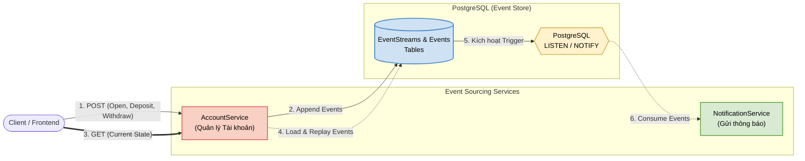

# Event Sourcing Pattern Flow & Structure

Đây là tài liệu mô tả luồng hoạt động (flow) của pattern **Event Sourcing** trong project `MicroservicePatterns`, tuân thủ theo các quy chuẩn kiến trúc đã đề ra trong `AGENT.md`.

## 1. Overview Diagram

Sơ đồ dưới đây thể hiện quy trình của Event Sourcing: thay vì lưu trạng thái hiện tại (Current State) của một đối tượng, hệ thống sẽ lưu trữ toàn bộ các sự kiện thay đổi (Domain Events) theo thời gian vào **Event Store**. Khi cần, trạng thái hiện tại sẽ được tái tạo (Rebuild/Replay) từ các sự kiện này.

---

## 2. Chi tiết luồng xử lý (Flow Details)

Khác với kiến trúc CRUD truyền thống, pattern này yêu cầu mọi nghiệp vụ (Business logic) đều phải sinh ra sự kiện thay vì thay đổi trực tiếp Entity.

### Bước 1: Khởi tạo và Lưu sự kiện (Write / Commands)
- Người dùng gọi các API `POST` đến `AccountService` (ví dụ: mở tài khoản, nạp tiền, rút tiền).
- `AccountService` nhận Command, khởi tạo Aggregate `Account` và thực thi Business Logic.
- Thay vì UPDATE trực tiếp số dư (Balance) vào database, Aggregate sinh ra các **Domain Events** (`AccountOpenedEvent`, `BalanceChangedEvent`).
- Những sự kiện này được ghi mới (Append-Only) vào **Event Store** (bảng `Events` & `EventStreams` trong PostgreSQL). Dữ liệu này là bất biến (Immutable), không bao giờ bị Update hay Delete.

### Bước 2: Tái tạo trạng thái (Read / Replay State)
- Khi Client gọi API `GET` để xem thông tin tài khoản hiện tại.
- `AccountService` truy vấn **tất cả các Events** thuộc về `AccountId` đó từ Event Store theo thứ tự thời gian.
- Khởi tạo một Aggregate `Account` trống, sau đó tuần tự **Replay (Phát lại)** các events vào Aggregate này (thông qua hàm `Apply()`).
- Sau khi chạy hết stream Event, ta thu được Current State để trả về cho Client.

### Bước 3: Side-effects và Integration (Bất đồng bộ)
- Ngay khi một Event được Insert vào bảng `Events` của PostgreSQL, Database trigger cơ chế `NOTIFY`.
- `NotificationService` đang duy trì connection `LISTEN` vào PostgreSQL sẽ lập tức nhận được thông báo về Event mới.
- Service này đọc thông tin Event và thực hiện các tác vụ bên ngoài như: Gửi Push Notification cho người dùng, gửi Email báo biến động số dư,...

---

## 3. Kiến trúc Event Store

| Thành phần | Vai trò | Mô tả |
| --- | --- | --- |
| **Bảng `EventStreams`** | Quản lý phiên bản Aggregate | Chứa tính toàn vẹn phiên bản (`Version`). Giúp ngăn chặn lỗi đồng thời (Concurrency) bằng Optimistic Concurrency. |
| **Bảng `Events`** | Lưu trữ dữ liệu lịch sử | Ghi nhận từng hành động (`Type`, `Data` định dạng JSONB, `CreatedAtUtc`). |

---

> **Note (AI Rules):** Mọi hành vi cập nhật trạng thái trong EventSourcing bắt buộc phải thông qua `ApplyChange(new Event(...))`. Cấm tuyệt đối việc tạo endpoint hoặc hàm để update Entity state nếu không có Event đi kèm.
